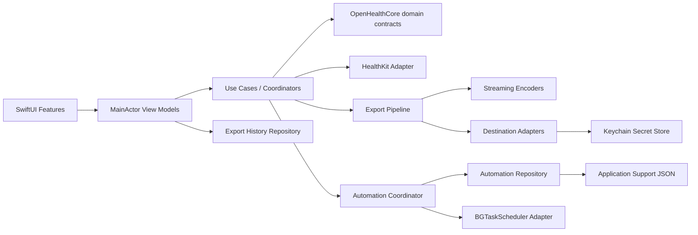

# OpenHealth Architecture & UI Overhaul Implementation Plan

> **For Hermes / Grok Build:** Implement this plan task-by-task. Do not stop after planning or scaffolding. Preserve the user's existing commit, make real file changes, run every verification command available in the current environment, and report any Xcode-only gate that cannot run.

**Goal:** Turn OpenHealth from an alpha SwiftUI prototype into a privacy-first, testable iOS/iPadOS health-export utility with one dependency graph, correct HealthKit/export behavior, secure destination credentials, reliable best-effort automations, and a coherent accessible UI.

**Architecture:** Use a pragmatic feature-first modular monolith. Keep pure domain models, scheduling logic, validation, and encoders in a Foundation-only `OpenHealthCore` source tree that is also built by Swift Package Manager for local tests. Keep HealthKit, BackgroundTasks, Keychain, notifications, iCloud, networking, and filesystem code behind narrow protocols in `Infrastructure`. Compose exactly one live dependency graph in `AppContainer`; only presentation state is main-actor isolated.

**Tech Stack:** Swift 5 language mode, SwiftUI, HealthKit, BackgroundTasks, Security/Keychain, OSLog, Foundation, XCTest/Swift Testing through SwiftPM, iOS/iPadOS 17+, no third-party runtime dependencies.

**Plan date:** 2026-08-01
**Repository:** `/Users/shersingh/github/OpenHealth`
**Current branch:** `main` (clean at audit time, one local commit ahead of `origin/main`)
**Document status:** Implemented and independently corrected on 2026-08-01. Sections describing the “current” prototype are retained as the historical pre-overhaul baseline; use the README for the live repository status. The repository owner subsequently authorized commit and push after final verification.

> **Implementation note (2026-08-01):** This host has Apple Command Line Tools but not full Xcode/XCTest. The implementation runs its Foundation-only executable harness with `Scripts/run_core_tests.sh`; the shared Xcode scheme and CI simulator build remain the app-level gate. References below to `swift test` describe the preferred future XCTest target, not a locally verified command on this host.

---

## 1. Executive verdict

The current project is a useful prototype, but it is **not production-safe yet**. The most important problems are behavioral, not cosmetic:

1. The app creates multiple independent `HealthKitService` and `ExportService` instances, so authorization/UI/export/automation state diverges.
2. HealthKit read authorization is represented incorrectly. Apple intentionally does not reveal whether read access was granted, yet the UI displays a definitive “Authorized.”
3. Preferred-unit lookup uses short identifiers while HealthKit supplies full raw identifiers. This can request incompatible units and can break non-count metrics.
4. “Export all” counts category, ECG, workout, and activity records but serializes only quantity samples plus separately fetched workouts. The file can claim records that are absent.
5. Workout route queries are constructed but never executed, and the callback handling is unsafe for batched route results.
6. Automation persistence, UI state, scheduler state, and test execution are separate code paths. Newly saved automations are not reliably scheduled, and “Test Now” can no-op.
7. Destination passwords/tokens are embedded in Codable models and can be written to plaintext `UserDefaults`.
8. Heavy HealthKit reads, string building, encoding, and file writes are isolated to `@MainActor`, which risks frozen UI and background-task expiration.
9. The test file and widget file are not included in any Xcode target. The existing tests also reference an initializer that does not exist and contain a mismatched Home Assistant token assertion.
10. The README advertises macOS, visionOS, exact background scheduling, 150+ metrics, and destinations that the Xcode project does not actually ship.

**Product decision:** OpenHealth should be an **export operations app**, not a pseudo-health-dashboard. The home screen should answer: “Can I export?”, “What ran last?”, “What runs next?”, and “Where does my data go?” Hard-coded activity goals and misleading rings should be removed from the primary experience.

---

## 2. Verified current-state baseline

### Repository facts

- 21 tracked Swift files, about 5,405 lines.
- Xcode project contains one iOS application target and 19 Swift source files.
- `Tests/ExportServiceTests.swift` and `Widgets/HealthExportWidget.swift` are tracked but absent from the project.
- `TARGETED_DEVICE_FAMILY = "1,2"`; this is an iPhone/iPad app, not a macOS app.
- `IPHONEOS_DEPLOYMENT_TARGET = 17.0`.
- No CI, shared test target, package manifest, privacy manifest, changelog, or app-store/release checks.
- App icon slots have no image filenames.
- The accent-color asset is blue, while many views hard-code red as the primary action color.

### Commands already run

```bash
# Passed: Swift syntax parser for app sources
swiftc -parse $(git ls-files '*.swift' ':!Tests/*' ':!Widgets/*')

# Passed: syntax parser for currently detached test and widget files
swiftc -parse Tests/ExportServiceTests.swift
swiftc -parse Widgets/HealthExportWidget.swift

# Passed: plist/project syntax
plutil -lint Resources/Info.plist Resources/OpenHealth.entitlements
plutil -lint OpenHealth.xcodeproj/project.pbxproj
```

### Build limitation in this environment

`xcodebuild` cannot run because only Apple Command Line Tools are installed and `/Applications/Xcode.app` is absent:

```text
xcode-select: error: tool 'xcodebuild' requires Xcode, but active developer directory
'/Library/Developer/CommandLineTools' is a command line tools instance
```

Therefore this implementation must provide two verification levels:

1. **Locally executable now:** `swift test`, `swiftc -parse`, plist validation, project-reference validation, secret/path checks.
2. **Required before release:** full Xcode iOS Simulator build, unit/UI tests, HealthKit device smoke test, background-task smoke test, and archive validation.

### Credential hygiene action already taken

The local Git remote contained embedded user information. It was changed without changing the repository destination to:

```text
https://github.com/shersingh7/OpenHealth.git
```

No credential may be written to this plan, source, logs, test fixtures, Git remote, or README. The previously embedded GitHub credential should be revoked/rotated by the repository owner.

---

## 3. Severity-ranked audit findings

| Severity | Evidence | Problem | Required correction |
|---|---|---|---|
| P0 | `App/OpenHealthApp.swift:14-18`, `Views/Export/ExportView.swift:370-377`, `Services/AutomationScheduler.swift:18-34`, `Views/Settings/SettingsView.swift:251-257` | Four independent service graphs create divergent authorization, progress, persistence, and export state. | One `AppContainer`, injected protocols, no feature-owned live services or singleton scheduler. |
| P0 | `Services/HealthKitService.swift:185-190`, `Views/Settings/SettingsView.swift:18-48` | Read permission is shown as definitively authorized even though HealthKit does not reveal read grants. | Model request state and availability; never infer/read-label “Authorized.” |
| P0 | `Models/HealthData.swift:100-105`, `Utilities/HealthTypeMetadata.swift:174-255` | Full raw HealthKit identifiers are passed into a switch keyed by short names, producing wrong/incompatible units. | One typed metric catalog keyed by canonical raw identifier; exhaustive tests for every supported quantity type. |
| P0 | `Services/ExportService.swift:50-56,100-134,272-296` | “Export all” drops category samples, ECG, and activity summaries; workouts can be fetched/counted twice. | A single canonical `ExportDocument` and one-pass pipeline; record counts derive from serialized sections only. |
| P0 | `Services/HealthKitService.swift:300-338` | `HKWorkoutRouteQuery` is never submitted to `HKHealthStore`; callbacks are batched but the code leaves on the first callback and mutates shared arrays unsafely. | Dedicated route reader that executes each query, honors `done`, errors, cancellation, deterministic ordering, and no cross-callback data race. |
| P0 | `Views/Automation/AutomationListView.swift:156-187`, `Services/AutomationScheduler.swift:52-155` | UI writes `UserDefaults` directly and bypasses scheduler/coordinator. | One repository and coordinator used by all automation UI/background/manual paths. |
| P0 | `Views/Automation/AutomationDetailView.swift:305-314` | “Test Now” passes an unsaved automation to a scheduler method that first searches persisted items; it can return without running. | Manual test directly calls the export use case with the draft configuration. |
| P0 | `Models/ExportDestination.swift:184-248`, automation Codable persistence | Tokens/passwords can be serialized into plaintext `UserDefaults`. | Secret references in models; values only in Keychain with background-compatible accessibility. |
| P0 | local `.git/config` before audit | GitHub credential was embedded in remote URL. | Keep credential-free remote and rotate old PAT. Add non-secret-scanning CI guard. |
| P1 | `Services/ExportService.swift` and `HealthKitService.swift` class annotations | Querying, conversion, huge string concatenation, XML/JSON generation, and disk/network work run under main-actor isolation. | Main actor only publishes view state; pipeline, encoders, persistence, and adapters are async/actors as appropriate. |
| P1 | `Services/HealthKitService.swift:395-451` | All metric types are queried sequentially; per-type failures are printed and silently omitted. | Bounded concurrency or deterministic per-type streaming; structured warnings included in result/UI. |
| P1 | `Services/HealthKitService.swift:340-359` | Activity summary query ignores the requested date range. | Build and test a range predicate; map to domain records before export. |
| P1 | `Models/Automation.swift:135-192` | Weekly algorithm returns the first sorted weekday’s next occurrence, not necessarily the earliest occurrence; retry scheduling can remain permanently due. | Injected clock/calendar; calculate all candidates then choose minimum; explicit retry/backoff and terminal state. |
| P1 | `Services/AutomationScheduler.swift:159-210` | Multiple requests share one task identifier and cancel each other; exact times are implied. | Maintain one pending request for the earliest enabled job and clearly label execution as best effort. |
| P1 | `Services/AutomationScheduler.swift:177-191` | Expiration logs but does not cancel active export; completion is always marked success. | Cancellation handler, persisted outcome, and truthful task completion. |
| P1 | `Services/AutomationScheduler.swift:231-235` | Notification permission is requested during singleton initialization without user intent. | Ask only when the user enables notifications/first automation. |
| P1 | `Views/Export/DestinationPickerView.swift` | Unsupported destinations are addable, and `DestinationConfigurationView` is never navigated to. | Show only implemented destinations as selectable; configure before saving; unsupported types in a clearly disabled “Planned” section. |
| P1 | `Models/ExportConfiguration.swift:150-153`, `Services/ExportService.swift` | `includeMetadata`, `summarizeData`, and `incrementalSince` are stored but not honored. | Honor each supported option or remove it from UI/model; no decorative switches. |
| P1 | `Services/ExportService.swift:395-438` | URL validation permits non-HTTP schemes; auth modes are partial; shared session may cache; API errors lose status/body context. | HTTPS-by-default validator, ephemeral injectable session, file upload, redacted diagnostics, testable status handling. |
| P1 | `Services/ExportService.swift:373-393` | User-controlled iCloud folder is appended without path-component validation. | Normalize and reject absolute paths, `..`, separators-as-components, and empty/control-character segments. |
| P1 | `Services/ExportService.swift:298-335` | GPX interpolates unescaped XML and can emit a “successful” empty route file. | XML escaping, route presence validation, schema/fixture tests. |
| P1 | `Resources/Info.plist:63-77`, `Resources/OpenHealth.entitlements` | iCloud container is declared in Info.plist but matching ubiquity entitlements are absent; identifier does not match bundle naming. | Align a stable container identifier and document Developer Portal requirement. |
| P1 | `OpenHealth.xcodeproj/project.pbxproj:360,390` | Personal development team is hard-coded in an open-source project. | Remove team from shared settings; document local signing. |
| P1 | `Tests/ExportServiceTests.swift`, project file | Tests are not built and include invalid assumptions/fixtures. | Foundation-only core package tests now; Xcode integration/UI target before release. |
| P2 | `Views/Dashboard/DashboardView.swift`, `DashboardViewModel.swift` | Hard-coded goals and locally calculated rings imply clinical/fitness accuracy the export app does not provide. | Replace with export readiness, recent export, next automation, data coverage, and privacy status. |
| P2 | all views | Inconsistent primary color, repeated card styling, limited errors/empty states, missing accessibility labels/IDs, no cancellation, poor iPad width handling. | Design tokens/components and explicit state matrix. |
| P2 | `SettingsViewModel`, `ExportViewModel` | Saved defaults are not used to initialize export configuration; available type count is stale. | Shared settings store and live data-coverage snapshot. |
| P2 | `Widgets/HealthExportWidget.swift` | Dead source with its own `@main`, no widget target or shared store. | Defer until an App Group/widget target is intentionally added; do not advertise it as shipped. |
| P2 | `README.md` | Platform, metric count, automation guarantees, and destination status exceed implemented behavior. | Rewrite from verified capability matrix and clearly mark best-effort/deferred items. |
| P2 | asset catalog | App icon slots are empty. | Add a valid generated/design asset set before release. |

---

## 4. Product and platform scope

### In scope for this refactor

- iPhone and iPad on iOS/iPadOS 17+.
- Read-only Apple Health access.
- Quantity, category, workout, workout-route, ECG metadata/waveforms where supported, and activity-summary export.
- CSV, versioned JSON, and GPX.
- Local Files, iCloud Drive, and REST API destinations.
- Best-effort manual/daily/weekly/monthly/hourly automation, with honest timing copy.
- Secure destination credentials in Keychain.
- Local export history containing operational metadata only, not duplicated health samples.
- Accessible responsive SwiftUI UI.
- Foundation-only core tests runnable without Xcode.
- Xcode/CI build configuration and truthful documentation.

### Explicit non-goals

- Medical advice, interpretation, diagnosis, or trend scoring.
- Writing data to HealthKit.
- macOS, visionOS, watchOS, or Mac Catalyst app targets in this phase.
- Google Drive, Dropbox, MQTT, Home Assistant, or Calendar implementations in this phase.
- Exact-time background guarantees.
- Cloud accounts, analytics, telemetry, crash uploads, or server-side storage.
- A widget until an App Group, widget target, shared history contract, and privacy review are implemented.
- “All 150+ metrics” marketing until generated catalog tests prove the exact shipped count.

---

## 5. Target architecture

### 5.1 Dependency flow



**Dependency rule:** `Core` imports Foundation only. `Infrastructure` depends on `Core`. `Features` depend on protocols/use cases, not HealthKit/Keychain/BGTaskScheduler concrete types. `App` is the only composition root.

### 5.2 Proposed tree

```text
OpenHealth/
├── Package.swift
├── App/
│   ├── OpenHealthApp.swift
│   ├── AppContainer.swift
│   ├── AppTab.swift
│   └── ContentView.swift
├── Core/                         # Foundation-only; also OpenHealthCore SwiftPM target
│   ├── Models/
│   │   ├── HealthMetric.swift
│   │   ├── HealthRecords.swift
│   │   ├── ExportModels.swift
│   │   ├── DestinationModels.swift
│   │   ├── AutomationModels.swift
│   │   ├── ExportHistory.swift
│   │   └── AppSettings.swift
│   ├── Protocols/
│   │   ├── HealthDataSource.swift
│   │   ├── ExportDestinationClient.swift
│   │   ├── SecretStore.swift
│   │   ├── AutomationRepository.swift
│   │   ├── ExportHistoryRepository.swift
│   │   └── BackgroundTaskScheduling.swift
│   ├── Export/
│   │   ├── CSVExportEncoder.swift
│   │   ├── JSONExportEncoder.swift
│   │   ├── GPXExportEncoder.swift
│   │   ├── FilenameGenerator.swift
│   │   └── XMLCSVSanitizers.swift
│   ├── Scheduling/
│   │   └── ScheduleCalculator.swift
│   └── Utilities/
│       ├── Clock.swift
│       ├── DateRangeResolver.swift
│       ├── PathValidator.swift
│       └── URLValidator.swift
├── Infrastructure/
│   ├── HealthKit/
│   │   ├── LiveHealthDataSource.swift
│   │   ├── HealthMetricCatalog.swift
│   │   ├── HealthKitRecordMapper.swift
│   │   └── WorkoutRouteReader.swift
│   ├── Export/
│   │   ├── ExportPipeline.swift
│   │   ├── LocalFileDestination.swift
│   │   ├── ICloudDestination.swift
│   │   └── RESTDestination.swift
│   ├── Persistence/
│   │   ├── JSONAutomationRepository.swift
│   │   ├── JSONExportHistoryRepository.swift
│   │   ├── UserDefaultsSettingsStore.swift
│   │   ├── KeychainSecretStore.swift
│   │   └── LegacyAutomationMigrator.swift
│   ├── Automation/
│   │   ├── AutomationCoordinator.swift
│   │   ├── BGTaskSchedulerClient.swift
│   │   └── NotificationClient.swift
│   └── Logging/
│       └── AppLogger.swift
├── DesignSystem/
│   ├── OpenHealthTheme.swift
│   ├── OHCard.swift
│   ├── OHStatusBadge.swift
│   ├── OHPrimaryButton.swift
│   ├── OHStateView.swift
│   └── OHProgressPanel.swift
├── Features/
│   ├── Onboarding/
│   │   ├── OnboardingView.swift
│   │   └── OnboardingViewModel.swift
│   ├── Home/
│   │   ├── HomeView.swift
│   │   └── HomeViewModel.swift
│   ├── Export/
│   │   ├── ExportBuilderView.swift
│   │   ├── ExportViewModel.swift
│   │   ├── DataTypeSelectionView.swift
│   │   ├── DateRangePickerView.swift
│   │   ├── DestinationPickerView.swift
│   │   ├── DestinationEditorView.swift
│   │   └── ExportResultView.swift
│   ├── Automations/
│   │   ├── AutomationListView.swift
│   │   ├── AutomationListViewModel.swift
│   │   ├── AutomationEditorView.swift
│   │   └── AutomationEditorViewModel.swift
│   └── Settings/
│       ├── SettingsView.swift
│       ├── SettingsViewModel.swift
│       └── DataCoverageView.swift
├── Resources/
│   ├── Info.plist
│   ├── OpenHealth.entitlements
│   ├── PrivacyInfo.xcprivacy
│   └── Assets.xcassets/
├── Tests/OpenHealthCoreTests/
├── Scripts/
│   ├── validate_project_references.py
│   └── check_secrets.py
├── .github/workflows/ci.yml
└── docs/
    ├── architecture.md
    ├── export-schema-v1.md
    ├── privacy-and-security.md
    └── plans/2026-08-01-openhealth-architecture-ui-overhaul.md
```

### 5.3 Composition root

`AppContainer` must instantiate each live dependency exactly once:

```swift
@MainActor
final class AppContainer: ObservableObject {
    let healthDataSource: any HealthDataSource
    let exportPipeline: ExportPipeline
    let automationRepository: any AutomationRepository
    let historyRepository: any ExportHistoryRepository
    let automationCoordinator: AutomationCoordinator
    let settingsStore: SettingsStore

    static func live() -> AppContainer { /* compose concrete adapters */ }
}
```

Rules:

- No `HealthKitService()` or `ExportService()` inside a view/view model.
- No global mutable `shared` scheduler.
- View-model initializers accept protocols/use cases.
- Previews use deterministic fakes from `#if DEBUG` fixtures.
- Only view models and `AppContainer` publish UI state on `@MainActor`.
- The pipeline, encoders, repositories, Keychain operations, and network/file adapters must not inherit main-actor isolation.

---

## 6. Core contracts and data schema

### 6.1 Authorization model

Never represent HealthKit read access as granted/denied. Use:

```swift
public struct HealthAccessState: Equatable, Sendable {
    public enum RequestState: Equatable, Sendable {
        case notRequested
        case requestRecommended
        case previouslyRequested
        case unavailable
    }

    public let isHealthDataAvailable: Bool
    public let requestState: RequestState
    public let lastRequestedAt: Date?
}
```

UI language:

- “Health access not requested”
- “Choose data access in Apple Health”
- “Health access requested”
- “No records found — this can mean no data or that access was not granted”

Never show “Read access authorized/denied.” `authorizationStatus(for:)` is only meaningful for share/write authorization.

### 6.2 Canonical metric catalog

Each supported metric has one descriptor keyed by the actual HealthKit raw identifier:

```swift
public struct HealthMetric: Identifiable, Codable, Hashable, Sendable {
    public enum Kind: String, Codable, Sendable { case quantity, category }
    public let id: String                 // exact HK raw identifier
    public let displayName: String
    public let category: HealthDataCategory
    public let kind: Kind
    public let canonicalUnit: String?     // nil for category values
    public let availability: MetricAvailability
}
```

`Infrastructure/HealthKit/HealthMetricCatalog.swift` owns the typed `HKQuantityTypeIdentifier`/`HKCategoryTypeIdentifier` and `HKUnit`. Core stores only portable strings. Add a test that converts a representative sample for **every** supported quantity type without falling back to `.count()` unless count is correct.

### 6.3 Export request

```swift
public struct ExportRequest: Codable, Sendable {
    public enum Selection: Codable, Sendable {
        case allDetected
        case explicit(Set<String>)
    }

    public let id: UUID
    public var name: String
    public var selection: Selection
    public var range: ExportDateRange
    public var format: ExportFormat
    public var destinationIDs: [UUID]
    public var includeMetadata: Bool
    public var includeWorkoutRoutes: Bool
    public var includeECGWaveforms: Bool
}
```

Validation invariants:

- Name trimmed and 1...80 visible characters.
- Custom `start < end`; end may not be in the future by more than clock tolerance.
- Explicit selection is non-empty.
- GPX requires workouts plus routes.
- At least one enabled, valid destination; do not silently invent a destination.
- Each destination has a unique ID and type/name.

### 6.4 Versioned JSON export document

The serialized file is the source of truth for counts:

```swift
public struct ExportDocument: Codable, Sendable {
    public let schemaVersion: Int         // 1
    public let exportID: UUID
    public let generatedAt: Date
    public let appVersion: String
    public let requestedRange: DateInterval
    public let includedMetricIDs: [String]
    public var quantityRecords: [QuantityRecord]
    public var categoryRecords: [CategoryRecord]
    public var workouts: [WorkoutRecord]
    public var electrocardiograms: [ECGRecord]
    public var activitySummaries: [ActivitySummaryRecord]
    public var warnings: [ExportWarning]
}
```

Record requirements:

- Stable source UUID where HealthKit provides one.
- Exact start/end timestamps encoded as ISO-8601 with fractional seconds.
- Canonical unit and numeric value.
- Source name and bundle identifier where available.
- Metadata only when requested; convert only JSON-safe scalar values and redact keys known to contain sensitive identifiers if not essential.
- Category value includes both integer raw value and a documented semantic label where known.
- Workout includes activity type, duration, energy, distance, source, and optional route points.
- ECG includes metadata and waveform points only when the HealthKit API succeeds; otherwise a structured warning, never a fabricated empty waveform.
- Activity summary includes date and move/exercise/stand values/goals.

`totalRecords` must be computed from the records actually written, never maintained as an independent mutable counter.

### 6.5 Export progress/result

```swift
public enum ExportPhase: Equatable, Sendable {
    case validating
    case reading(current: Int, total: Int, label: String)
    case encoding(format: ExportFormat)
    case delivering(current: Int, total: Int, name: String)
    case completed
}

public struct ExportReport: Sendable {
    public let exportID: UUID
    public let startedAt: Date
    public let completedAt: Date
    public let serializedRecordCount: Int
    public let artifactURL: URL?
    public let destinationResults: [DestinationDeliveryResult]
    public let warnings: [ExportWarning]
    public var isCompleteSuccess: Bool { /* all requested destinations succeeded */ }
    public var isPartialSuccess: Bool { /* at least one succeeded and one failed/warned */ }
}
```

Partial success must not be rendered as a plain green success state.

---

## 7. Security and privacy design

1. **Secrets:** Store bearer tokens, API keys, MQTT-style credentials from legacy data, and future OAuth tokens in Keychain. Persist only `SecretReference` IDs in Codable destination models.
2. **Keychain accessibility:** Use `kSecAttrAccessibleAfterFirstUnlockThisDeviceOnly` for credentials required by best-effort background exports. Document this trade-off. Never synchronize secrets through iCloud Keychain unless explicitly designed later.
3. **Migration:** Decode the old `openhealth.automations` blob into a legacy DTO, write each secret to Keychain, write a new atomic file, verify it decodes, then remove the old defaults key. On any failure, leave the old blob untouched and surface a migration error.
4. **Files:** Use Application Support for configuration/history and Documents/iCloud only for user export artifacts. Write atomically through a temporary file. Apply appropriate data-protection attributes and exclude temporary files from backups.
5. **REST:** HTTPS only in release. Allow loopback HTTP only under a DEBUG-only explicit switch. Use `URLSessionConfiguration.ephemeral`, no cookie/cache persistence, injectable session, redacted logs, bounded timeouts, and file uploads where possible.
6. **Redirects:** Reject an HTTPS request that redirects to HTTP. Do not log authorization headers, query parameters, response bodies, filenames containing user-entered data, health values, or metadata.
7. **Paths:** Reject absolute paths, `..`, empty path components, control characters, and path separators hidden inside a component.
8. **Logs:** Replace `print` with `Logger`; mark all potentially identifying strings `.private` and log operational counts only when safe.
9. **Privacy manifest:** Add `PrivacyInfo.xcprivacy`; declare no collected data because the app does not transmit data to the developer. Declare required-reason API usage accurately (including app-container `UserDefaults` usage where applicable). User-directed exports are not developer collection, but App Store privacy answers must still be reviewed before release.
10. **Permission timing:** Do not request HealthKit or notifications automatically at process launch. Explain first; request after an explicit user action.
11. **Marketing copy:** Say “OpenHealth does not collect your data. Data is sent only to destinations you choose.” Do not say data is never shared while offering REST exports.
12. **Git:** Keep remote URLs credential-free. `Scripts/check_secrets.py` prints only file paths/rule IDs, never matching secret values.

---

## 8. UI / design system

### 8.1 Information architecture

Root tabs remain familiar but become purposeful:

1. **Home** — readiness, quick export, latest result, next best-effort automation, detected coverage, privacy.
2. **Export** — guided export builder.
3. **Automations** — saved jobs, status, history, editor.
4. **Settings** — access, defaults, destinations/security, storage, notifications/background, about.

On iPad, use split navigation inside Automations and Settings where it improves list/detail flow. Keep root tabs; do not create a macOS sidebar for a platform not shipped.

### 8.2 Visual language

| Token | Value/behavior |
|---|---|
| Primary action | `Color.accentColor`, system blue-compatible; never hard-coded red |
| Health highlight | Dynamic coral/red used for heart/health symbols, not every CTA |
| Success/warning/error | Semantic system green/orange/red plus icon and text; never color alone |
| Background | System grouped background |
| Card | Secondary grouped background, 16 pt radius, 1 px separator stroke, no repeated heavy shadows |
| Spacing | 4, 8, 12, 16, 24, 32 |
| Control height | Minimum 44 pt |
| Content width | iPhone full width; iPad forms/cards centered at max 760 pt |
| Typography | Dynamic Type text styles only; monospaced digits for counts/progress |
| Motion | Short native transitions; respect Reduce Motion |

Components:

- `OHCard`
- `OHStatusBadge`
- `OHPrimaryButton`
- `OHStateView` for loading/empty/error/access states
- `OHProgressPanel` with phase label, progress, cancel button, and VoiceOver announcements
- `OHDestinationRow`
- `OHSectionHeader`

### 8.3 Home screen

```text
┌──────────────────────────────────────┐
│ OpenHealth                           │
│ Private health exports, under you.   │
├──────────────────────────────────────┤
│ HEALTH ACCESS                        │
│ ● Access requested / Action needed   │
│ [Review Health Access]               │
├──────────────────────────────────────┤
│ [ Create Export ]  primary CTA       │
│ Last 24h • JSON • Local Files        │
├──────────────────────────────────────┤
│ LAST EXPORT                          │
│ Partial success • 12,420 records     │
│ 2 destinations • 1 warning           │
├──────────────────────────────────────┤
│ NEXT AUTOMATION                      │
│ Daily Backup • Earliest after 2:00am │
├──────────────────────────────────────┤
│ DATA COVERAGE                        │
│ 47 detected types • scanned 4m ago   │
├──────────────────────────────────────┤
│ OpenHealth does not collect data.    │
└──────────────────────────────────────┘
```

Remove the current hard-coded activity rings/goals from the primary home experience. If health previews are ever added later, they require clearly sourced HealthKit statistics and separate product scope.

States:

- First launch/onboarding.
- HealthKit unavailable.
- Access not requested.
- Access requested but no visible records (ambiguous by design).
- Loading coverage.
- Export in progress.
- No export history.
- Complete success / partial success / failure.

### 8.4 Export builder

Use one scrollable builder with four numbered sections and a pinned bottom action:

1. **Data** — “All detected data” or “Choose data types.” Show category/type count and route/ECG privacy badges.
2. **Time range** — presets plus validated custom start/end.
3. **Format & privacy** — format cards with clear capability notes. GPX only for routes. Metadata and ECG waveform options explain sensitivity/size.
4. **Destinations** — configured cards; add/edit/remove; explicit local destination rather than hidden fallback.

Bottom area:

```text
Ready: 47 types • Last 30 days • JSON • 2 destinations
[ Export ]
```

Invalid state shows inline messages adjacent to the field and a summary for VoiceOver. During export, replace the CTA with `OHProgressPanel`; permit cancellation. Completion sheet shows:

- Complete / Partial / Failed.
- Serialized record count.
- Warnings grouped by health type.
- Per-destination status.
- Share/Open Files action for a local artifact.
- Retry failed destinations without rereading HealthKit when the temporary artifact still exists.

### 8.5 Data type selection

- Search display name and identifier.
- Group by category with category-level tri-state selection.
- Show “Detected” vs “Supported but no visible records.”
- “Select all detected,” not ambiguous “Select all.”
- Preserve selection while searching.
- Sort categories and metrics deterministically.
- VoiceOver labels include selection state and category.

### 8.6 Destination flow

Selectable now:

- Local Files
- iCloud Drive
- REST API

Planned/nonselectable:

- Google Drive, Dropbox, MQTT, Home Assistant, Calendar

Adding REST opens an editor before insertion. Fields:

- Name
- HTTPS endpoint
- POST/PUT/PATCH
- Authentication: None/Bearer/API key (only modes actually implemented)
- Secret field stored to Keychain
- Optional non-secret headers with reserved-header validation
- “Test connection” using a metadata-only request only if the endpoint contract supports it; never upload health samples just to validate configuration without explicit copy/confirmation

### 8.7 Automations

List row shows:

- Name and enabled/paused state.
- “Earliest after …” schedule wording.
- Data scope (`All detected`, not `0 types`).
- Destination names.
- Last result and next eligible date.
- Warning if Background App Refresh/notifications are unavailable.

Editor sections:

- Name and enabled state.
- Best-effort schedule with explanatory footer.
- Reusable export configuration editor.
- Destinations.
- Notification preference.
- “Run Draft Now” calls the export pipeline directly.
- Save disabled until validation passes.

Deleting requires confirmation and removes associated Keychain secrets only when no other destination references them.

### 8.8 Settings

Sections:

1. Health Access — request/review access with privacy-correct wording.
2. Export Defaults — format, range, metadata, routes; these must actually seed new exports.
3. Background & Notifications — current statuses and links to system settings.
4. Storage — export folder, artifact/history sizes, clear actions with confirmation and error reporting.
5. Privacy & Security — local-only statement, Keychain note, REST destination disclosure, privacy policy/docs.
6. Diagnostics — app version/build, non-sensitive log export, last automation scheduling error.
7. About — correct GitHub URL `https://github.com/shersingh7/OpenHealth`, MIT license, supported platforms.

### 8.9 Accessibility acceptance criteria

- Every icon-only button has an accessibility label and hint.
- Status never depends on color alone.
- 44×44 minimum hit targets.
- Dynamic Type through accessibility sizes without clipping critical controls.
- VoiceOver reads export phase changes without announcing every record.
- Search/selection supports Switch Control and keyboard activation.
- Logical focus after sheets dismiss and after validation fails.
- Reduce Motion and Increase Contrast respected.
- Accessibility identifiers on all primary flows for future UI tests.

---

## 9. Detailed implementation tasks

> Each task ends with an observable gate. Suggested commit messages are documentation only; do **not** commit during this delegated run.

### Phase 0 — Safety and deterministic core

#### Task 1: Add a Foundation-only core test harness

**Objective:** Make domain logic executable and testable on this Mac without Xcode.

**Files:**
- Create: `Package.swift`
- Create: `Core/Models/*`, `Core/Protocols/*`, `Core/Utilities/*`
- Create: `Tests/OpenHealthCoreTests/SmokeTests.swift`
- Modify: `.gitignore`

**Steps:**

1. Define package product/target `OpenHealthCore`, path `Core`, Foundation only, Swift tools 5.10 or a compatible installed version.
2. Define test target `OpenHealthCoreTests`, path `Tests/OpenHealthCoreTests`.
3. Add a smoke test that imports the core module and constructs a deterministic date range.
4. Do not import SwiftUI, UIKit, HealthKit, BackgroundTasks, Security, UserNotifications, or OSLog in `Core`.

**Verify:**

```bash
swift package describe
swift test --parallel
```

**Expected:** Package resolves locally with zero network dependencies and smoke test passes.

**Suggested commit:** `build: add Foundation-only OpenHealthCore test harness`

#### Task 2: Introduce injected time and correct date ranges

**Files:**
- Create: `Core/Utilities/Clock.swift`
- Create: `Core/Utilities/DateRangeResolver.swift`
- Create: `Tests/OpenHealthCoreTests/DateRangeResolverTests.swift`
- Replace later: date logic in `Models/ExportConfiguration.swift`

**Steps:**

1. Add `Clock` protocol and `SystemClock`/`FixedClock`.
2. Make date-range resolution accept explicit `Calendar`, `TimeZone`, and `now`.
3. Define inclusive/exclusive semantics: start inclusive, end exclusive.
4. Test today/yesterday/rolling 24 hours/week/month/year/custom/all-time.
5. Test DST spring/fall boundaries and a non-Gregorian user calendar by normalizing the app’s export calendar policy.
6. Validate custom ranges and produce typed errors.

**Verify:** `swift test --filter DateRangeResolverTests`

#### Task 3: Replace duplicated identifier metadata with one canonical metric model

**Files:**
- Create: `Core/Models/HealthMetric.swift`
- Create: `Infrastructure/HealthKit/HealthMetricCatalog.swift`
- Create: `Tests/OpenHealthCoreTests/HealthMetricTests.swift`
- Retire after migration: `Utilities/HealthTypeMetadata.swift`

**Steps:**

1. Store exact HealthKit raw IDs in core descriptors.
2. In the HealthKit catalog, associate each quantity identifier with a compatible `HKUnit` and category/display metadata.
3. Normalize full raw IDs once; never switch on short ad-hoc strings.
4. Remove metadata sets that disagree with the supported arrays.
5. Add a catalog invariant function used by an Xcode-side test: unique IDs, non-empty names, quantity unit present, category unit absent.
6. Add pure tests for ID normalization/display ordering.

**Gate:** No `.count()` fallback for an unknown quantity metric. Unknown types become a typed unsupported warning.

#### Task 4: Define portable health records and versioned export schema

**Files:**
- Create: `Core/Models/HealthRecords.swift`
- Create: `Core/Models/ExportModels.swift`
- Create: `Core/Models/ExportHistory.swift`
- Create: `docs/export-schema-v1.md`
- Retire after migration: HealthKit-backed record definitions in `Models/HealthData.swift`

**Steps:**

1. Define Codable/Sendable quantity, category, workout, route, ECG, and activity-summary records without HealthKit types.
2. Define `ExportDocument` schema version 1 and structured warnings.
3. Ensure counts are computed from encoded sections.
4. Document every field, unit, timestamp format, nullability, and compatibility rule.
5. Add golden JSON fixture test and decode/encode round-trip.

**Verify:** `swift test --filter ExportSchemaTests`

#### Task 5: Implement validation and sanitizers first

**Files:**
- Create: `Core/Utilities/PathValidator.swift`
- Create: `Core/Utilities/URLValidator.swift`
- Create: `Core/Export/XMLCSVSanitizers.swift`
- Create tests for each.

**Test cases:**

- Valid nested folder vs `/absolute`, `../escape`, repeated separators, control chars, empty components.
- HTTPS URLs; reject malformed/non-HTTP; loopback HTTP allowed only through an explicit parameter.
- CSV commas, quotes, CR/LF, Unicode, spreadsheet-formula prefixes as a documented choice.
- XML escaping for `& < > " '` and invalid scalar filtering.

**Verify:** `swift test --filter ValidatorTests`

### Phase 1 — One dependency graph and correct HealthKit adapter

#### Task 6: Add protocol boundaries and deterministic fakes

**Files:**
- Create: `Core/Protocols/HealthDataSource.swift`
- Create: `Core/Protocols/ExportDestinationClient.swift`
- Create: `Core/Protocols/SecretStore.swift`
- Create: `Core/Protocols/AutomationRepository.swift`
- Create: `Core/Protocols/ExportHistoryRepository.swift`
- Create: `Core/Protocols/BackgroundTaskScheduling.swift`
- Create: `Core/Protocols/SettingsStore.swift`
- Create: `Tests/OpenHealthCoreTests/Fakes.swift`

**Requirements:**

- Protocol methods are minimal, async where needed, cancellation-aware, and do not expose HealthKit/UIKit types.
- Fakes record calls and can inject data/errors/delays.
- No protocol exists merely to mirror every method of a concrete class.

#### Task 7: Build `AppContainer` and remove feature-owned live services

**Files:**
- Create: `App/AppContainer.swift`
- Create: `App/AppTab.swift`
- Modify: `App/OpenHealthApp.swift`
- Modify: `App/ContentView.swift`
- Modify all feature view-model initializers.
- Delete/retire singleton ownership in `Services/AutomationScheduler.swift`.

**Steps:**

1. Compose one `LiveHealthDataSource`/`HKHealthStore`.
2. Compose one export pipeline, settings store, automation repository/coordinator, history repository, and secret store.
3. Inject feature view models from the root or environment.
4. Remove automatic HealthKit request from `.onAppear`.
5. Remove `UIApplicationDelegateAdaptor` if SwiftUI background-task registration can fully replace it; otherwise make the delegate a thin injected bridge with no service construction.
6. Assert in debug that only one live container is composed.

**Gate:** repository search returns no live service constructors in `Features/` or views.

```bash
python3 Scripts/validate_project_references.py
swiftc -parse $(git ls-files '*.swift' ':!Tests/*' ':!Widgets/*')
```

#### Task 8: Correct HealthKit authorization semantics

**Files:**
- Create/modify: `Infrastructure/HealthKit/LiveHealthDataSource.swift`
- Modify: onboarding, home, and settings view models.
- Remove: definitive read-authorization booleans/status.

**Steps:**

1. Check `HKHealthStore.isHealthDataAvailable()`.
2. Use HealthKit request-status API only to decide whether requesting is recommended.
3. Request read-only types after explicit user action.
4. Record only that the request flow completed and when; do not infer grants.
5. Treat empty query results as ambiguous.
6. Return structured per-query errors/warnings without exposing health values to logs.

**Manual device gate:** deny some/all read types and verify UI never claims a definitive denial/grant.

#### Task 9: Map HealthKit objects into portable records correctly

**Files:**
- Create: `Infrastructure/HealthKit/HealthKitRecordMapper.swift`
- Modify: `Infrastructure/HealthKit/LiveHealthDataSource.swift`
- Retire: HealthKit-bearing export models in `Models/HealthData.swift`

**Steps:**

1. Query each requested quantity/category type with date predicate and deterministic start-date ordering.
2. Use the typed catalog unit for quantity conversion.
3. Respect `includeMetadata`.
4. Convert workouts once; do not fetch/count them through two paths.
5. Query ECG metadata/waveform via documented HealthKit APIs. If waveform retrieval fails, preserve metadata and add warning.
6. Query activity summaries with an explicit requested range predicate.
7. Check task cancellation between metric types and route/ECG batches.
8. Limit concurrent query work to a small bound (for example 4), not one unbounded task per metric.

**Gate:** no `HKWorkout`, `HKElectrocardiogram`, or `HKActivitySummary` escapes Infrastructure.

#### Task 10: Fix workout route batching and cancellation

**Files:**
- Create: `Infrastructure/HealthKit/WorkoutRouteReader.swift`
- Add Xcode-side adapter tests/fake callback harness where possible.

**Steps:**

1. Fetch route samples associated with the workout.
2. Execute every `HKWorkoutRouteQuery` through the health store.
3. Accumulate every callback batch until `done == true`.
4. Resume each continuation exactly once.
5. Propagate query errors and cancellation.
6. Sort points by timestamp and de-duplicate identical timestamp/coordinate points.
7. Never mutate an unsynchronized shared array from concurrent callbacks.

**Manual gate:** route-bearing outdoor workout exports non-empty ordered GPX; route-free workout produces an explicit “no route data” warning, not a false-success empty GPX.

### Phase 2 — Export pipeline, destinations, and secrets

#### Task 11: Implement streaming/file-backed encoders

**Files:**
- Create: `Core/Export/CSVExportEncoder.swift`
- Create: `Core/Export/JSONExportEncoder.swift`
- Create: `Core/Export/GPXExportEncoder.swift`
- Create: `Core/Export/FilenameGenerator.swift`
- Create tests and fixtures.

**Requirements:**

- Write to a caller-provided temporary URL/FileHandle rather than one giant in-memory String/Data.
- JSON uses schema v1 and valid commas/brackets under zero, one, and many records.
- CSV uses stable column order and RFC 4180-compatible escaping; category/workout sections must not masquerade as the same table without a documented schema.
- GPX is valid XML 1.1 structure, escapes names, and refuses no-route exports.
- Filename uses injected clock, fixed locale/calendar/time zone, sanitized prefix, UUID collision suffix as needed.
- Cancellation removes incomplete temporary artifacts.

**Verify:** golden-file tests plus XML parse test using Foundation XMLParser where available.

#### Task 12: Build one export pipeline

**Files:**
- Create: `Infrastructure/Export/ExportPipeline.swift`
- Retire: `Services/ExportService.swift` after all callers migrate.
- Create: `Tests/OpenHealthCoreTests/ExportPipelineContractTests.swift` using fakes or isolate a pure coordinator in Core.

**Pipeline:**

1. Validate request/destinations.
2. Resolve date interval from injected clock/calendar.
3. Create protected temporary artifact.
4. Read only requested data types/special sections.
5. Encode each record exactly once.
6. Collect structured warnings.
7. Deliver the same artifact to each destination.
8. Persist operational history.
9. Remove temp artifact according to retry/share policy.
10. Publish progress through `AsyncStream<ExportProgress>` or equivalent.

**Behavior:**

- Throw only for pipeline-fatal failures before a usable report can be produced.
- Per-type and per-destination failures become structured report entries.
- Overall state distinguishes complete success, partial success, failure, and cancelled.
- Retrying a destination must not reread HealthKit while a valid artifact exists.

#### Task 13: Implement local and iCloud file destinations

**Files:**
- Create: `Infrastructure/Export/LocalFileDestination.swift`
- Create: `Infrastructure/Export/ICloudDestination.swift`
- Modify: entitlements/Info.plist later in Task 25.

**Requirements:**

- Accept artifact file URL, not duplicate `Data`.
- Validate destination folder through `PathValidator`.
- Create directories atomically and use collision-safe names.
- Surface iCloud unavailable/not-signed-in/container errors precisely.
- Explicit local destination required; no hidden fallback.
- Return final file URL and bytes written.

#### Task 14: Implement hardened REST destination

**Files:**
- Create: `Infrastructure/Export/RESTDestination.swift`
- Create: `Infrastructure/Export/RedirectPolicyDelegate.swift`
- Add URLProtocol-based integration tests when Xcode/Foundation networking permits.

**Requirements:**

- HTTPS in release; explicit debug-only loopback exception.
- POST/PUT/PATCH only until GET semantics are intentionally implemented.
- None/Bearer/API-key auth only until other modes exist.
- Ephemeral injectable session, no cache/cookies/credential storage.
- Upload from file.
- Reject insecure redirects.
- Validate custom header names and forbid overriding Host, Content-Length, Authorization, and Content-Type outside dedicated fields.
- Capture status code and a bounded, redacted error description; never persist response bodies containing sensitive data.

#### Task 15: Add Keychain secret references

**Files:**
- Create: `Infrastructure/Persistence/KeychainSecretStore.swift`
- Modify: `Core/Models/DestinationModels.swift`
- Add protocol contract tests; add Security-framework integration gate for Xcode.

**Requirements:**

- Add/update/read/delete by destination-scoped opaque ID.
- `AfterFirstUnlockThisDeviceOnly` for background-needed credentials.
- No secret in Codable/debug description/equality/hash/logging.
- Editing an unchanged masked field does not overwrite a valid secret with placeholder bullets.
- Deleting a destination removes orphaned secrets.

### Phase 3 — Persistence and best-effort automation

#### Task 16: Create atomic repositories and legacy migration

**Files:**
- Create: `Infrastructure/Persistence/JSONAutomationRepository.swift`
- Create: `Infrastructure/Persistence/JSONExportHistoryRepository.swift`
- Create: `Infrastructure/Persistence/LegacyAutomationMigrator.swift`
- Create: `Core/Models/AutomationModels.swift`
- Create: `Core/Models/ExportHistory.swift`
- Retire direct persistence in `AutomationListViewModel` and `AutomationScheduler`.

**Steps:**

1. Store versioned envelopes in Application Support using atomic replacement.
2. Cap operational history by count/age; never duplicate exported health values.
3. Preserve IDs, run count, last run/error, retry state, next eligibility, created/modified dates.
4. Migrate legacy defaults transactionally and move secrets to Keychain.
5. Do not delete legacy data until new data and secrets verify.
6. Test fresh install, successful migration, corrupt JSON, partial Keychain failure, repeated migration, and downgrade coexistence.

#### Task 17: Correct schedule calculation and retry state

**Files:**
- Create: `Core/Scheduling/ScheduleCalculator.swift`
- Create: `Tests/OpenHealthCoreTests/ScheduleCalculatorTests.swift`
- Retire schedule math from `Models/Automation.swift`.

**Tests:**

- Daily before/after configured time.
- Weekly chooses the earliest candidate across selected days.
- Empty weekly days is invalid.
- Monthly day behavior across short months is explicit (clamp or skip; choose and document).
- DST skipped/repeated times.
- Time-zone change.
- Manual returns no next date.
- Failure backoff and max retries.
- Completed run advances from completion/eligible anchor without immediate rerun loop.

#### Task 18: Implement one automation coordinator and one pending BG request

**Files:**
- Create: `Infrastructure/Automation/AutomationCoordinator.swift`
- Create: `Infrastructure/Automation/BGTaskSchedulerClient.swift`
- Modify: `App/OpenHealthApp.swift`
- Retire: `Services/AutomationScheduler.swift`.

**Algorithm:**

1. Load enabled automations.
2. Execute due items serially or with a safe explicit bound.
3. Persist running/terminal state around each export.
4. Honor cancellation/expiration and mark incomplete jobs truthfully.
5. Compute the earliest next eligible job.
6. Cancel the existing request for the single identifier and submit exactly one request with that earliest date.
7. On app launch/background transition/save/delete/enable toggle/run completion, reconcile once.
8. Explain in UI that `earliestBeginDate` is not a guarantee.

**Test using fake scheduler:** exactly one pending request, cancellation on no enabled jobs, earliest-date selection, submission errors surfaced.

#### Task 19: Move notification permission behind user intent

**Files:**
- Create: `Infrastructure/Automation/NotificationClient.swift`
- Modify automation editor/settings.

**Requirements:**

- Request only when user enables completion notifications.
- Persist preference separately from system authorization status.
- Do not include destination URL, filename, health type, or health value in notification body.
- Distinguish denied/system-disabled in UI with Settings deep link.

### Phase 4 — UI overhaul

#### Task 20: Add theme and reusable components

**Files:** `DesignSystem/*.swift` listed in the target tree.

**Steps:**

1. Replace hard-coded `.red` primary actions with semantic theme tokens.
2. Implement cards, status badges, primary button, state view, and progress panel.
3. Add Dynamic Type previews and dark/high-contrast previews.
4. Centralize spacing/radius/content-width values.
5. Add accessibility labels/hints/identifiers.

**Gate:** search production views for repeated card shadow/background chains and hard-coded primary red; exceptions require a health-semantic reason.

#### Task 21: Add consent-first onboarding/access flow

**Files:**
- Create: `Features/Onboarding/OnboardingView.swift`
- Create: `Features/Onboarding/OnboardingViewModel.swift`
- Modify: root routing and settings access section.

**Screens:**

1. Private by design.
2. What OpenHealth reads and why.
3. Destinations remain under user control.
4. Explicit “Choose Health Access” button.

Skip is allowed; app remains usable enough to explain how to enable later. Do not request notifications here.

#### Task 22: Replace Dashboard with export operations Home

**Files:**
- Create: `Features/Home/HomeView.swift`
- Create: `Features/Home/HomeViewModel.swift`
- Remove/retire: `Views/Dashboard/DashboardView.swift`
- Remove/retire: `ViewModels/DashboardViewModel.swift`

**Requirements:** implement the wireframe/states in Section 8.3; remove hard-coded goals/rings. Quick export navigates to a prefilled builder rather than silently starting a large export.

#### Task 23: Rebuild export builder and result states

**Files:**
- Create/replace files under `Features/Export/`.
- Retire embedded `ExportViewModel` from `Views/Export/ExportView.swift`.

**Requirements:**

- Inject dependencies.
- Seed actual saved defaults.
- Four numbered sections and pinned CTA.
- Inline validation and accessible summary.
- Explicit destination.
- Progress phases/cancel.
- Complete/partial/failure result.
- Per-type warnings and per-destination results.
- Share/open action only for available local artifact.
- No ignored toggles.

#### Task 24: Rebuild destination selection/editor

**Files:**
- `Features/Export/DestinationPickerView.swift`
- `Features/Export/DestinationEditorView.swift`

**Requirements:** only Local/iCloud/REST selectable; disabled planned section; configuration before insertion; Keychain-backed secret editing; delete confirmation; protocol validation; safe test behavior.

#### Task 25: Rebuild automation list/editor around coordinator

**Files:**
- `Features/Automations/AutomationListView.swift`
- `Features/Automations/AutomationListViewModel.swift`
- `Features/Automations/AutomationEditorView.swift`
- `Features/Automations/AutomationEditorViewModel.swift`

**Requirements:**

- Repository/coordinator is single source of truth.
- Correct “All detected” count/copy.
- Best-effort timing wording.
- Preserve all execution fields when editing.
- “Run Draft Now” always calls pipeline directly.
- Save/delete triggers one reconciliation.
- Errors and background settings visible.

#### Task 26: Rebuild Settings and data coverage

**Files:**
- `Features/Settings/SettingsView.swift`
- `Features/Settings/SettingsViewModel.swift`
- `Features/Settings/DataCoverageView.swift`
- `Infrastructure/Persistence/UserDefaultsSettingsStore.swift`

**Requirements:** implement Section 8.8; wire defaults to export; live coverage count includes quantity and category types; clear actions confirm and surface filesystem errors; correct GitHub links; no force-unwrapped URLs.

### Phase 5 — Project, privacy, CI, documentation

#### Task 27: Repair Xcode project membership and portable signing

**Files:**
- Modify: `OpenHealth.xcodeproj/project.pbxproj`
- Create: `OpenHealth.xcodeproj/xcshareddata/xcschemes/OpenHealth.xcscheme` if absent.
- Create: `Scripts/validate_project_references.py`

**Steps:**

1. Add all production Swift files/resources exactly once.
2. Remove retired files and `OpenHealth.entitlements` from Copy Bundle Resources; keep it only as code-sign entitlements.
3. Include all `Core/**/*.swift` in the app target while `Package.swift` also compiles them as `OpenHealthCore` for pure tests.
4. Remove hard-coded `DEVELOPMENT_TEAM` from shared project settings.
5. Keep app target iPhone/iPad only and document truthfully.
6. Add a shared scheme suitable for CI.
7. The validation script compares tracked production files/resources to project references and fails on missing/duplicate membership.
8. Keep detached widget source out of the app; either remove it in this refactor or move it under documented experimental/backlog content. Do not add a second `@main` to the app target.

**Verify:**

```bash
python3 Scripts/validate_project_references.py
plutil -lint OpenHealth.xcodeproj/project.pbxproj
```

#### Task 28: Correct capabilities, privacy metadata, and assets

**Files:**
- Modify: `Resources/Info.plist`
- Modify: `Resources/OpenHealth.entitlements`
- Create: `Resources/PrivacyInfo.xcprivacy`
- Modify: asset catalog/app icon.

**Requirements:**

- Remove misleading write-health usage copy if no write permission is requested.
- Rewrite Health usage text: export to user-chosen destinations; developer does not collect.
- Align iCloud container identifier consistently, preferably `iCloud.com.shersingh7.openhealth`, in Info.plist and entitlements. Document that the container must exist in the Apple Developer portal.
- Keep BackgroundTasks identifier consistent everywhere.
- Add accurate privacy manifest and required-reason declarations.
- Add real app-icon filenames/assets; no empty icon slots.
- Use the accent asset consistently.
- Do not claim HealthKit background delivery if it is disabled/not implemented.

**Verify:** `plutil -lint Resources/*.plist Resources/*.entitlements Resources/*.xcprivacy`

#### Task 29: Replace non-running tests and add CI

**Files:**
- Remove/replace: `Tests/ExportServiceTests.swift`
- Add: focused tests under `Tests/OpenHealthCoreTests/`.
- Create: `.github/workflows/ci.yml`
- Create: `Scripts/check_secrets.py`

**CI jobs:**

1. Core job: `swift test --parallel`.
2. Static job: project references, plist lint, Swift parse, secret-path scan.
3. Xcode job on a supported macOS runner: select latest stable Xcode, generic iOS Simulator build with code signing disabled, then simulator tests when a deterministic destination is available.

Never mask failures with `|| true`. Secret scan prints only rule and file path.

Minimum test matrix:

- Date ranges and schedules with fixed clock/time zones/DST.
- Canonical metric IDs/units/categories.
- Export schema round-trip/counts.
- CSV/JSON/GPX golden files and escaping.
- Request/destination/path/URL validation.
- Pipeline full/partial/failure/cancellation using fakes.
- Repository atomic writes and legacy migration.
- Keychain protocol behavior (plus Xcode integration test later).
- REST status/redirect/header behavior with URLProtocol.
- Automation one-request reconciliation.
- View-model state transitions with fakes.

#### Task 30: Rewrite docs from verified behavior

**Files:**
- Rewrite: `README.md`
- Create: `docs/architecture.md`
- Create: `docs/privacy-and-security.md`
- Ensure: `docs/export-schema-v1.md`

**README rules:**

- iOS/iPadOS 17+ only.
- Exact metric count generated from catalog or no fixed count.
- Destination support table: Local/iCloud/REST shipped; others planned.
- Background execution is best effort and not exact.
- Explain HealthKit read-permission ambiguity.
- Installation includes Xcode/full Apple developer capability requirements.
- Correct repo links.
- Tests/CI commands are executable.
- Separate “implemented,” “device verification required,” and “planned.”

#### Task 31: Remove dead/duplicate legacy code

**Files to retire after call-site migration:**

- `Models/Automation.swift`
- `Models/ExportConfiguration.swift`
- `Models/ExportDestination.swift`
- `Models/HealthData.swift`
- `Services/AutomationScheduler.swift`
- `Services/ExportService.swift`
- `Services/HealthKitService.swift`
- `Utilities/HealthTypeMetadata.swift`
- old `Views/**` equivalents
- detached/nonfunctional widget source unless explicitly preserved outside build scope

**Gate:** no duplicate type names, no direct `UserDefaults.standard` outside settings/migration adapter, no `URLSession.shared`, no live service singleton, no credentials in Codable models, no `print` in production code.

---

## 10. Verification gates

### Gate A — Must pass in the current environment

```bash
cd /Users/shersingh/github/OpenHealth

swift package describe
swift test --parallel

swiftc -parse $(git ls-files '*.swift' ':!Tests/*' ':!Widgets/*')

plutil -lint Resources/Info.plist
plutil -lint Resources/OpenHealth.entitlements
plutil -lint Resources/PrivacyInfo.xcprivacy
plutil -lint OpenHealth.xcodeproj/project.pbxproj

python3 Scripts/validate_project_references.py
python3 Scripts/check_secrets.py

git status --short
git diff --check
git diff --stat
git diff -- . ':!docs/plans/2026-08-01-openhealth-architecture-ui-overhaul.md'
```

Expected: all commands exit 0; only intentional source/docs/project changes appear; no build/generated artifacts or secret values are tracked.

### Gate B — Required with full Xcode installed

```bash
DEVELOPER_DIR=/Applications/Xcode.app/Contents/Developer \
  xcodebuild -project OpenHealth.xcodeproj \
  -scheme OpenHealth \
  -destination 'generic/platform=iOS Simulator' \
  CODE_SIGNING_ALLOWED=NO \
  build

# Pick an installed simulator deterministically before running this gate.
DEVELOPER_DIR=/Applications/Xcode.app/Contents/Developer \
  xcodebuild -project OpenHealth.xcodeproj \
  -scheme OpenHealth \
  -destination 'platform=iOS Simulator,name=iPhone 16 Pro' \
  test
```

Also run Analyze with strict concurrency warnings reviewed. Do not declare build success until this gate really runs.

### Gate C — Real-device HealthKit acceptance

Use a test device and synthetic/non-sensitive records where possible:

1. Fresh install: onboarding appears before any permission prompt.
2. Grant partial Health read selection: UI says access requested, not globally authorized.
3. Export one quantity and one category type; inspect exact values/units/timestamps.
4. Export all detected; compare report counts with JSON section counts.
5. Export a workout with route; verify ordered GPX opens in a GPX viewer.
6. Export a route-free workout; verify warning/no false success.
7. Export ECG where available; verify metadata/waveform behavior or warning.
8. Cancel a large export; UI recovers and no partial artifact remains.
9. Local, iCloud, and test REST destinations each produce truthful per-destination status.
10. Lock device and exercise a best-effort automation after first unlock; document actual data-protection/background behavior.
11. Deny notifications; automation still runs and UI explains notification state.
12. Relaunch after legacy migration; automations and run history remain, secrets are not in defaults/files.

### Gate D — UI/accessibility acceptance

- iPhone portrait/landscape and iPad split view.
- Light/dark mode.
- Dynamic Type through largest accessibility size.
- VoiceOver primary flow.
- Reduce Motion and Increase Contrast.
- Keyboard/Switch Control selection and save/export actions.
- No clipped progress/error/destination URL content.
- No unsupported destination appears enabled.
- Partial success visually differs from complete success.

### Gate E — Release/operations

- Clean checkout can build with documented steps.
- Shared scheme exists.
- No personal development team or embedded Git credentials.
- App icon and privacy manifest included in built product.
- Entitlements in signed product match intended HealthKit/iCloud/background capabilities.
- Archive validation succeeds.
- README capability matrix matches shipped UI and code.

---

## 11. Migration, rollout, and rollback

### Migration order

1. Add new core models/protocols/tests without deleting legacy code.
2. Add infrastructure adapters and app container.
3. Migrate one feature at a time to new use cases.
4. Add legacy automation migration and verify it with fixtures copied from the old model shape.
5. Switch root UI to new features.
6. Delete old services/models/views only after repository search confirms no call sites.
7. Update project membership/docs/CI.

### Data migration safety

- New repository envelope includes `schemaVersion`.
- Old defaults remain until migration transaction verifies.
- Keychain writes happen before new destination records are committed.
- A migration marker contains only version/timestamp, not secrets.
- On failure, app loads read-only recovery UI and offers retry; it does not silently reset automations.

### Rollback

- Keep migration decoder for at least one release.
- Do not mutate old defaults until verified success.
- Export schema is additive within version 1; breaking changes require version 2.
- Destination secret references remain opaque/stable across app versions.
- Do not roll back by copying secrets from Keychain into JSON/UserDefaults.

---

## 12. Apple documentation references

- HealthKit authorization status: <https://developer.apple.com/documentation/healthkit/hkhealthstore/authorizationstatus(for:)>
- Authorizing health data: <https://developer.apple.com/documentation/healthkit/authorizing-access-to-health-data>
- Workout route query: <https://developer.apple.com/documentation/healthkit/hkworkoutroutequery>
- Reading route data: <https://developer.apple.com/documentation/healthkit/reading-route-data>
- Background app refresh request: <https://developer.apple.com/documentation/backgroundtasks/bgapprefreshtaskrequest>
- Keychain services: <https://developer.apple.com/documentation/security/keychain-services>
- Privacy manifests: <https://developer.apple.com/documentation/bundleresources/privacy-manifest-files>
- Required-reason API declarations: <https://developer.apple.com/documentation/bundleresources/describing-use-of-required-reason-api>

---

## 13. Definition of done

The overhaul is complete only when:

- [ ] One live dependency graph exists; no feature creates live services.
- [ ] HealthKit read-access copy is privacy-correct.
- [ ] Every supported quantity type has a compatible canonical unit test.
- [ ] Serialized counts exactly match quantity/category/workout/ECG/activity records written.
- [ ] Workout routes execute, batch, cancel, and order correctly.
- [ ] Category/ECG/activity data is exported or yields explicit warnings; nothing is silently counted then dropped.
- [ ] Export work is off the main actor and cancellation-safe.
- [ ] Local/iCloud/REST destinations are the only selectable implemented destinations.
- [ ] Destination credentials exist only in Keychain.
- [ ] Legacy automation migration is transactional and tested.
- [ ] One coordinator/repository owns manual, saved, and background automation behavior.
- [ ] Background schedule copy says “earliest/best effort,” not exact execution.
- [ ] Home/export/automation/settings UI implements all key states and accessibility criteria.
- [ ] `swift test`, parse checks, plist checks, project-reference check, and secret scan pass.
- [ ] Xcode build/test gate is either passed with real output or clearly marked blocked by missing Xcode.
- [ ] Real-device HealthKit and background gates remain explicitly separate from static/code sign-off.
- [ ] README and privacy docs describe only verified shipped behavior.
- [ ] `git status --short` contains only intentional changes and no generated artifacts/secrets.
